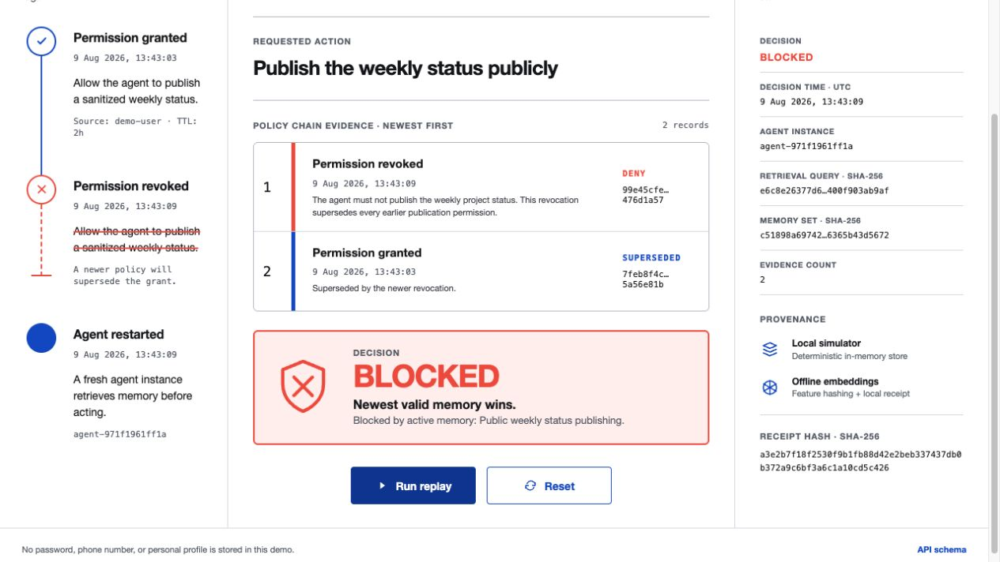
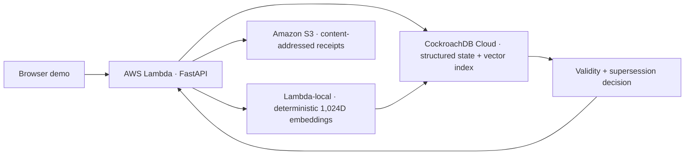

# RecallLease

**Memory that expires safely.** RecallLease is a working agent-memory guard that
keeps a revoked or expired instruction from quietly returning after an agent
restart.

The demo begins with permission to publish a sanitized weekly status. A newer
policy revokes that permission and supersedes the old record. A fresh agent
instance then performs vector retrieval from persistent memory. RecallLease
blocks the publish action and emits a content-addressed receipt proving which
memory set produced the decision.

Built for the [CockroachDB × AWS Hackathon — Build with Agentic Memory](https://cockroachdb-ai.devpost.com/).



## Why this exists

Most memory demos celebrate recall. Production agents also need reliable
forgetting. An old permission can become dangerous when it outlives a policy
change, user revocation, or validity window. RecallLease treats memory as a
lease with source, status, validity, and supersession—not as an immortal text
fragment.

## What the replay proves

1. A public-status permission is written with a source and validity window.
2. A later denial atomically marks the earlier permission as `superseded`.
3. A fresh agent instance queries the CockroachDB vector index instead of using
   process-local state.
4. Relevant active denials can block the action. Free-text similarity never
   grants positive authority; a non-denied action requires human review.
5. The active denial blocks publication and a SHA-256 receipt records the
   retrieval query, memory-set digest, decision, and agent instance.

## Architecture



CockroachDB supplies the durable memory ledger, transactionally safe
supersession, and distributed vector retrieval. AWS Lambda creates a fresh
agent boundary and produces deterministic 1,024-dimensional query vectors
without a paid model call. S3 retains short-lived audit receipts.

The local mode uses deterministic adapters for a zero-network replay. It runs
the same policy service and API contract but never claims to be the cloud
backend in the interface.

## Run locally

Requirements: Python 3.13 and [uv](https://docs.astral.sh/uv/).

```bash
uv sync --frozen
uv run uvicorn main:app --host 127.0.0.1 --port 8000
```

Open <http://127.0.0.1:8000>, then select **Run replay**. No cloud account,
credential, or network call is required in local mode.

Build the supplemental public replay as a static site:

```bash
uv run python -m scripts.build_static_demo
python3 -m http.server 4173 --directory dist
```

This version labels itself **Public replay** and runs a fixed policy scenario
entirely in the browser. It makes no CockroachDB or AWS request and is not the
cloud proof. A submission video must use the planned continuous loopback
walkthrough against verified CockroachDB and S3 adapters; until that capture
exists, the static build is only a safe, cost-free functional URL for reviewers.

Run the verification suite:

```bash
uv run ruff format --check .
uv run ruff check .
uv run pytest
```

## Deploy to AWS

The SAM template creates one IAM-authenticated Lambda Function URL and one
private S3 receipt bucket. It caps Lambda concurrency at two, expires receipts
after seven days, and retains logs for three days. It does not contain
credentials or expose an anonymously invokable cloud endpoint.

The cloud submission plan uses two required CockroachDB tools: `ccloud` CLI to
provision and inspect a bounded Basic cluster, and Distributed Vector Indexing
for active-memory retrieval. Create nothing until AWS reports an active Free
account plan with remaining credits. The verifier rejects Paid, expired,
wrong-account, low-lifetime, and unparseable states:

```bash
uv run python -m scripts.verify_zero_cost_cloud --aws-only
```

If that gate passes, create one Basic cluster with limits far below the trial
credit and inspect the resulting live state immediately:

```bash
ccloud auth login
ccloud cluster create BASIC recalllease us-east-1 \
  --cloud AWS --request-unit-limit 1000000 --storage-gib-limit 1 --wait
uv run python -m scripts.verify_zero_cost_cloud --cockroach-only
```

Bootstrap a dedicated `recalllease` database with a separate administrator
connection before deploying. Do not use `recalllease_app` as the administrator:
console-created SQL users initially receive `admin`. The script creates or
updates the runtime user, removes its `admin` membership, grants only the needed
database and table privileges, and verifies that it can read the required
tables. The password prompt is hidden; use a unique value of at least 32
characters.

```bash
export RECALLLEASE_ADMIN_DATABASE_URL='host=... port=26257 dbname=defaultdb user=recalllease_bootstrap sslmode=verify-full sslrootcert=/absolute/path/to/ca-bundle.pem'
uv run python -m scripts.bootstrap_database
```

Do not deploy with the administrator URL. Build a CockroachDB connection string
for the generated `recalllease_app` user and the `recalllease` database, retain
`sslmode=verify-full`, and store it as a Standard AWS Systems Manager
`SecureString`. Only the parameter name enters the Lambda configuration:

```bash
read -rs RECALLLEASE_DATABASE_URL
aws ssm put-parameter \
  --name /recalllease/cockroach-database-url \
  --type SecureString \
  --tier Standard \
  --value "$RECALLLEASE_DATABASE_URL"
unset RECALLLEASE_DATABASE_URL

uv run python -m scripts.verify_zero_cost_cloud
uv run python -m scripts.build_sam
sam deploy --guided \
  --template-file .aws-sam/build/template.yaml \
  --parameter-overrides \
    CockroachDatabaseUrlParameterName=/recalllease/cockroach-database-url
```

The build wrapper first proves that the hash-pinned Lambda requirements are an
exact export of the frozen `uv.lock`, rejects repository-local build-tool
shims, and copies an exact reviewed manifest of 15 runtime files before SAM
packages the function. Untracked descendants, caches, tests, design files, and
environment files are not copied. Production refuses to start unless the IAM
front door names a Parameter Store value, `RECALLLEASE_BACKEND=cockroach`, an
S3 receipt bucket is present, and the decrypted DSN uses the dedicated
`recalllease_app` login, `recalllease` database, password authentication, and
`sslmode=verify-full`. Runtime startup only validates the schema; the Lambda
role cannot create users, databases, tables, or indexes.

Basic clusters expose SQL through an IP allowlist. The bounded demo keeps DB
Console access disabled, but the Lambda Function URL does not provide a stable
outbound address without adding a paid VPC/NAT path, so SQL remains reachable
from `0.0.0.0/0`. That is network reachability, not anonymous database access:
the only deployed login is the random, password-authenticated
`recalllease_app` role above, TLS hostname and CA verification are mandatory,
and the role has no `admin`, DDL, user-management, or database-ownership rights.
Do not weaken those controls or deploy the bootstrap administrator credential.

[AWS documents](https://docs.aws.amazon.com/awsaccountbilling/latest/aboutv2/free-tier-plans.html)
that a Free account plan incurs no charges and closes when its credits or plan
lifetime are exhausted. Never upgrade this demo account, join AWS Organizations,
or enable another feature that converts it to Paid. The fail-closed verifier
requires `FREE` and `ACTIVE`, positive USD credits, the same STS account, and at
least seven days remaining before every deploy. The CockroachDB verifier requires
the exact `recalllease` Basic cluster on AWS with no more than 1,000,000 RUs and
1 GiB storage per month. It also requires the current `ccloud` draft invoice to
total exactly USD 0, show an applied negative `Free trial credits` adjustment,
and cover at least seven more days. This does not rely on the separate monthly
Basic credit, which requires a pay-as-you-go payment method. The trial
organization has no payment method; never add one. If either verifier fails, do
not deploy or record the cloud demo.

The template's default profile performs embeddings inside Lambda and grants no
Bedrock permission, removing per-token model charges. The optional `bedrock`
adapter is kept for operators who explicitly configure and fund it; it is not
part of the zero-cost release. The Function URL is an operator endpoint. Invoke
it only
with an explicitly authorized IAM principal and a SigV4-signed client. For the
continuous browser walkthrough, generate a random
`RECALLLEASE_LOOPBACK_CAPABILITY`, run the loopback web app with the CockroachDB
and S3 settings, and open the app once with
`#capability=<generated-value>`. The script removes the fragment immediately,
keeps the value only in memory, and sends it on API requests. Keep the address
bar outside the capture. Verify cloud records before recording so no terminal,
credential, or account screen appears in the video.

## Demo safety

- The hosted Lambda front door requires AWS IAM authentication; anonymous
  internet requests cannot create sessions or consume provider calls.
- The template's Lambda role has no Bedrock permission; embeddings run locally
  in the function and therefore cannot create model-inference charges.
- Random 256-bit session tokens are stored only as SHA-256 hashes.
- Every token has an expiry and a fixed total request budget.
- The deployment profile permits at most 20 new sessions per UTC hour, eight API
  uses per session, and two concurrent Lambda executions.
- CockroachDB supplies the authoritative decision timestamp; application-host
  clock skew cannot activate a future permission early.
- A decision receipt is committed only if the retrieved memory version is still
  current and neither the session nor the next time-driven policy transition
  has elapsed; either change forces a fresh retrieval.
- Memory writes recheck session expiry in the same commit transaction.
- Memory and receipt endpoints require a matching tenant token.
- Cloud-backed loopback API requests additionally require a random capability;
  the fixed browser marker alone is not authentication.
- Session creation requires the first-party browser marker and rejects
  cross-site state-changing requests by `Origin` and Fetch Metadata.
- Input length and timezone validity are enforced by Pydantic.
- API responses use `no-store`; the UI never writes tokens to local storage.
- CSP, frame denial, MIME sniffing protection, and a no-referrer policy apply
  to every response.
- S3 blocks public access, encrypts objects, and deletes demo receipts after
  seven days.
- The demo stores no password, phone number, private path, or personal profile.

See [docs/architecture.md](docs/architecture.md) for data flow and trust
boundaries and [docs/demo-script.md](docs/demo-script.md) for the under-three-
minute recorded walkthrough.

## Project layout

```text
frontend/           Code-native interactive demo
scripts/            Allowlisted Lambda and static-replay build wrappers
recalllease/        Policy service, stores, embeddings, receipts, API
infra/template.yaml AWS SAM deployment with bounded resources
tests/              API, authorization, expiry, and revocation proofs
design/             Accepted primary-screen design concept
docs/               Architecture, security, and video narrative
```

## AI use disclosure

OpenAI Codex and image generation were used during implementation and interface
concept development. The executable behavior, security controls, tests, and
submission artifacts are reviewed and verified by the entrant. The final demo
narration uses the locally generated Qwen3-TTS Aiden voice in a calm tone.

## License

[MIT](LICENSE) © 2026 RecallLease Contributors
